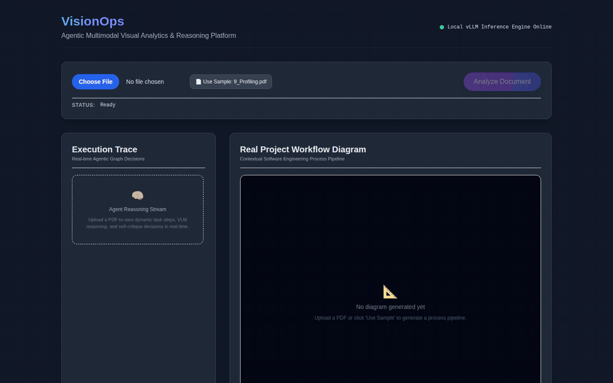

# VisionOps

> Agentic Multimodal Visual Analytics & Reasoning Platform



VisionOps is a local-first agentic multimodal AI platform that analyzes visual information, constructs structured representations, performs reasoning, generates visual outputs, evaluates those outputs through visual critique, and iteratively refines them.

## Architecture

```
Next.js Frontend → FastAPI API → LangGraph Core → vLLM (Qwen2.5-VL)
```

**Core principle:** The VLM performs perception, interpretation, and reasoning. Deterministic software performs validation and rendering.

## V1 Capability

**Technical Document → Diagram Skill**

Upload a technical PDF → extract concepts, relationships, equations → generate structured diagram → visual critique → refinement → explanation

## Quick Start

### Prerequisites

- Python 3.12+
- Node.js 18+
- uv
- GPU with ≈16 GB VRAM (for vLLM)

### Backend

```bash
uv sync
uv run uvicorn apps.api.main:app --host 0.0.0.0 --port 8001 --reload
```

### Frontend

```bash
cd apps/web
npm install
npm run dev
```

### vLLM Server

```bash
vllm serve Qwen/Qwen2.5-VL-7B-Instruct \
    --max-model-len 4096 \
    --gpu-memory-utilization 0.85
```

### Tests

```bash
uv run pytest
```

## Project Structure

```
├── apps/
│   ├── api/          # FastAPI backend
│   └── web/          # Next.js frontend
├── packages/
│   └── core/         # VisionOps core library
├── prompts/          # VLM prompt templates
├── specs/            # Specifications
├── tests/            # Test suite
├── scripts/          # Utility scripts
└── data/             # Runtime data (uploads, outputs)
```

## Technology Stack

| Component | Technology |
|-----------|-----------|
| Backend | FastAPI, Pydantic v2 |
| Agent Orchestration | LangGraph |
| Model Serving | vLLM |
| VLM | Qwen2.5-VL-7B-Instruct |
| Rendering | Mermaid → SVG |
| Frontend | Next.js, React, TypeScript, Tailwind |
| PDF Processing | PyMuPDF |
| Streaming | Server-Sent Events |

## License

MIT
